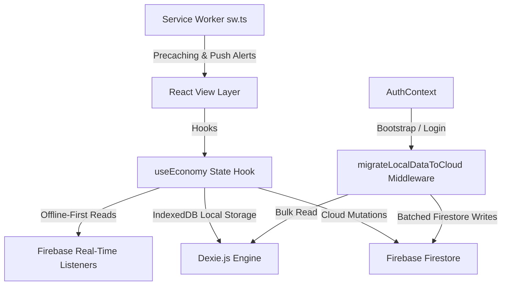

# Technical Architecture: Cost of Living 🪙💻

This document provides a comprehensive overview of the design patterns, data synchronization mechanisms, and core algorithms implemented in **Cost of Living**. It is written for technical recruiters, reviewers, and engineering leads to outline the architectural choices that keep the application performant, type-safe, and resilient.

---

## 🗺️ High-Level System Architecture

Cost of Living is designed with a **local-first, cloud-synchronized** architecture. The client maintains complete usability offline by logging operations immediately, which are then queued or synchronized with the cloud once an internet connection is established.



---

## 📊 Data Models & Schema Design

Database objects are strongly typed. The local schema is defined via Dexie versioning in [db.ts](file:///c:/Developer/a%20-%20Aremore%20Company%20%28codesource%29/cost-of-living%20%28Gamified%20Schedule%29/src/store/db.ts) and maps 1-to-1 with Firestore Collections.

```typescript
export interface UserAction {
    id: string;
    name: string;
    value: number;
    questType?: 'main' | 'side' | 'none';
}

export interface Todo {
    id: string;
    name: string;
    targetDate: string; // YYYY-MM-DD
    createdAt: number;
}

export interface Transaction {
    id?: number | string;
    actionId?: string;
    actionName: string;
    value: number;
    timestamp: number;
    type: 'user' | 'tax' | 'debt' | 'bankruptcy';
}

export interface Reward {
    id: string;
    name: string;
    cost: number;
    tier: 'common' | 'rare' | 'epic';
}
```

---

## ⚡ Core Economic Engine Lifecycle

The core economic simulation logic resides in the custom React hook [useEconomy.ts](file:///c:/Developer/a%20-%20Aremore%20Company%20%28codesource%29/cost-of-living%20%28Gamified%20Schedule%29/src/hooks/useEconomy.ts). 

### 1. The Daily Processing Loop (Catch-Up Job)
When the application mounts and authentication completes, a background worker runs to process any calendar days that have elapsed since the user last active session (`lastProcessDate` vs. `todayStr`). 

The logic iterates day-by-day to ensure chronological execution of missed penalties, daily taxes, and interest compounding:

```typescript
// Loop forward from last process date to today
while (differenceInDays(todayDate, loopDate) > 0) {
    const elapsedDayStr = format(loopDate, 'yyyy-MM-dd');
    loopDate = new Date(loopDate.getTime() + 24 * 60 * 60 * 1000);
    daysProcessed++;

    // 1. Process Failed To-Dos (Daily Contracts)
    const missedTodos = allTodos.filter((t) => t.targetDate === elapsedDayStr);
    for (const todo of missedTodos) {
        currentBalance -= 15; // Deduct penalty
        batch.set(txRef, { actionName: `Failed To-Do: ${todo.name}`, value: -15, ... });
        batch.delete(todo.ref); // Delete from active contracts list
    }

    // 2. Process Flat Daily Tax
    currentBalance -= DAILY_TAX; // RM 5
    batch.set(taxRef, { actionName: 'Daily Tax', value: -5, ... });

    // 3. Process Compounding Debt Interest
    if (currentBalance < 0) {
        const debtCharge = Math.abs(currentBalance) * DEBT_RATE; // 25% daily rate
        const roundedCharge = Math.round(debtCharge * 100) / 100;
        if (roundedCharge > 0) {
            currentBalance -= roundedCharge;
            batch.set(debtRef, { actionName: 'Debt Compound (25%)', value: -roundedCharge, ... });
        }
    }
}
```

### 2. Streak Multipliers
Earnings are multiplied based on consistency. If `streakCount >= 3`, completing a habit triggers a **1.2x streak bonus**, which is dynamically computed and appended to the logged transaction title:

```typescript
if (action.value > 0) {
    newStreak = state.streakCount || 0;
    const lastPosStr = state.lastPositiveActionDate;
    if (lastPosStr && lastPosStr !== todayStr) {
        newStreak += 1;
    }
    if (newStreak >= 3) {
        multiplier = 1.2;
        finalValue = Math.round(finalValue * multiplier * 100) / 100;
    }
}
```

---

## 🔄 Offline-First & Bulk Migration Protocol

One of the application's core engineering achievements is its handling of user migrations from guest/local states to synchronized cloud accounts.

### 🛡️ Preventing Firestore Batch Limits (500 Write Operations)
Firestore transactional write batches are capped at 500 write operations. If a long-time local user registers, their historical ledger might contain thousands of transactions. To prevent sync crashes:
1. The migration utility [migrate.ts](file:///c:/Developer/a%20-%20Aremore%20Company%20%28codesource%29/cost-of-living%20%28Gamified%20Schedule%29/src/lib/migrate.ts) checks for a boolean `migrated` flag in Firestore (`users/${uid}/appState/migration`).
2. If `migrated === false`, it computes local transaction balances and builds a main initialization batch (writing initial app states, custom habits, and active rewards).
3. It segments local transactions into sub-arrays of **450 operations** each.
4. It commits the main setup batch, then sequentially fires separate write batches for each historical transaction chunk.

```typescript
// Split transactions into chunks of 450 to stay safely below Firestore limit
let txChunks = [];
for (let i = 0, j = allTxs.length; i < j; i += 450) {
    txChunks.push(allTxs.slice(i, i + 450));
}

// Commit first chunk with main configuration batch
await batch.commit();

// Sequentially upload remaining chunk batches
if (txChunks.length > 1) {
    for (let c = 1; c < txChunks.length; c++) {
        const chunkBatch = writeBatch(db);
        for (const tx of txChunks[c]) {
             const ref = doc(collection(db, `users/${uid}/transactions`), tx.id?.toString());
             chunkBatch.set(ref, txData);
        }
        await chunkBatch.commit();
    }
}
```

---

## 📱 Progressive Web App (PWA) & Push Messaging

The PWA configuration resides in `vite.config.ts` and uses `vite-plugin-pwa` to register the service worker:

- **Resource Caching**: Workbox handles automatic assets precaching (`cleanupOutdatedCaches`, `precacheAndRoute`).
- **Push Event Listeners**: Listening on the `push` event parses incoming JSON payloads from Firebase Cloud Messaging (FCM) to trigger native system OS alerts:
  ```typescript
  self.addEventListener('push', (event) => {
      let payload = { notification: { title: 'Notification', body: 'New alert!' } };
      if (event.data) {
          try { payload = event.data.json(); } catch (e) {}
      }
      event.waitUntil(
          self.registration.showNotification(payload.notification.title, {
              body: payload.notification.body,
              icon: '/pwa-192x192.svg',
              tag: payload.notification.tag || 'default-push'
          })
      );
  });
  ```
- **FCM Token Registration**: FCM client registration handles token requests via browser VAPID keys, updates Firestore records, and uses `postMessage` to sync worker notification status.
